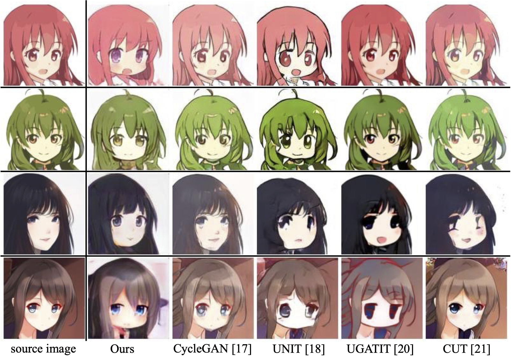

# Illustrated Character Face Super-Deformation via Unsupervised Image-to-Image Translation

[[Paper](#)] | [[Code](#)]

<div align="center">
 	
</div>

## Abstract

> Super-deformation in character design refers to a simplified modeling of character illustrations that are drawn in detail. Such super-deformation requires both texture and geometrical translation. However, directly adopting conventional image-to-image translation methods for super-deformation is challenging as these methods use a pixel-wise loss which makes the translated images highly dependent on the spatial information of the input image. This study propose a novel deep architecture-based method for the super-deformation of illustrated character faces using an unpaired dataset of detailed and super-deformed character face images collected from the Internet. First, we created a dataset construction pipeline based on image classification and character face detection using deep learning. Then, we designed a generative adversarial network (GAN) that was trained using two discriminators, each for detailed and super-deformed images, and a single generator, capable of synthesizing identical pairs of characters with different textural and geometrical appearance. As ornaments are an important element in character identification, we further introduced ornament augmentation to enable the generator to synthesize a variety of ornaments on the generated character faces. Finally, we constructed a loss function to project character illustrations provided by the user to the learned GAN latent space, which can find an identical super-deformed version. The experimental results show that compared to baseline methods, the proposed method can successfully translate character illustrations to identical super-deformed versions. The codes are available on the Internet.

## Notifications

We will not publish the trained model due to copyright laws. Also, we are not responsible for any violations of copyright laws by models trained by users of this software.

For the same reason we will not publish the dataset we used to train our model, including the ornaments we manually cropped out. Still, we make the weights of the classification and detection model open, which can help to reproduce our deformed/detailed dataset.

## Requirements

- torch (Tested on >= 1.10.0)
- torchvision (Install a version according to torch)
- detectron2 (Optional. Used in [face_detection](./face_detection/).)
- hydra-core
- opencv-python
- scikit-image
- matplotlib
- tqdm
- ninja (For building CUDA kernels.)

## Training

- Edit configuration files.

    Instructions for some of the parameters.

    - Common

        - `config.data.ornament_root`: Set to the folder of ornament images.

    - Harmonizer ([this](./config/config/harmonizer.yaml) file)

        - `config.data.data_root`: Set to the folders of illustrated character faces.

    - ChibiGAN ([this](./config/config/chibigan.yaml) file)

        - `config.data.data_root`: A list of two folders. First for detailed, second for deformed images.

- First train Harmonizer.

    ```terminal
    python main.py config=harmonizer config.train.epochs=50
    ```

- Then train the generator.

    ```terminal
    python main.py config=chibigan \
        config.model.h_config_file=<config file for harmonizer> \
        config.model.h_weight_file=<trained harmonizer weights>
    ```

- Finally, run inversion.

    ```terminal
    python inversion.py <input file or folder> <config file for generator> <trained generator weights>
    ```

    See all options by using `--help`.


## Docker

We provide a docker container with required python packages. See [docker-compose.yaml](./docker-compose.yaml), [Dockerfile](./docker/torch/Dockerfile), and [requirements.txt](./docker/torch/requirements.txt) for details.

## Issues

Open an issue for bugs or questions about the software. PRs are welcomed.

## Citation

```bibtex
@article{Sawada2024,
  author={Sawada, Tomoya and Katsurai, Marie},
  title={Illustrated character face super-deformation via unsupervised image-to-image translation},
  journal={Multimedia Systems},
  year={2024},
  volume={30},
  number={2},
  pages={63},
  issn={1432-1882},
  doi={10.1007/s00530-023-01255-y},
  url={https://doi.org/10.1007/s00530-023-01255-y}
}
```

## License

[License](./LICENSE)

## Author

[Tomoya Sawada](https://github.com/STomoya/)
